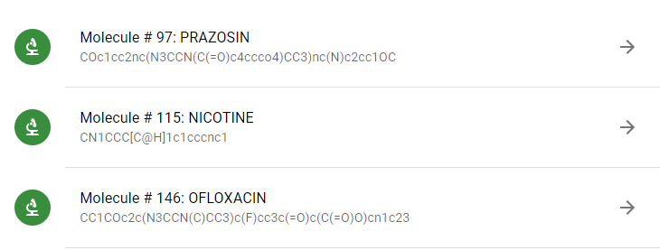
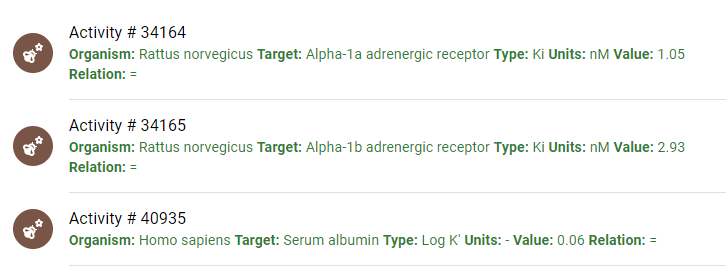
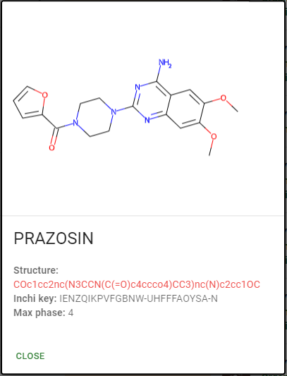

# Molecules App

This app uses Django rest framework and ReactJS. It uses The [Material UI library](https://mui.com) to sketch an interface utilizing 
material components. Finally, the [RDKit library](https://github.com/MichelML/rdkit-js) is used to build molecules images.

### About Endpoints

- Get Molecules: `http://localhost:8000/molecule`
- Get Activities by Molecule: `http://localhost:8000/molecule/<id_molecule>/activity`
- Get detailed Molecule: `http://localhost:8000/molecule/<id_molecule>`

### About pagination
The endpoints to get molecules and their activities have been paginated using two optional attributes: `page_size` and 
`page_number`, their default values are `1` and `10` respectively. The above functionality allows us to have more 
flexibility and comfort, for instance:

- `http://localhost:8000/molecule?page_number=2&page_size=5` gets 5 results for page 2.

### About Frontend

It was utilized _material_ components to sketch the interface. The following are application's screenshots:

#### List Molecules

#### List Activities by Molecule

#### Detailed molecule

#### All together

### How to run the application?
